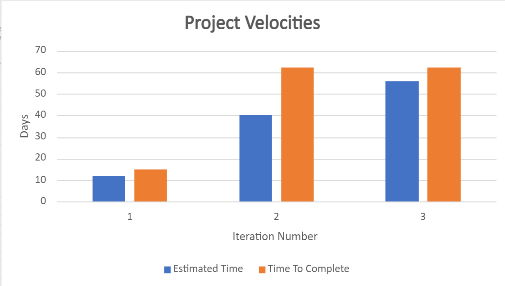

Last iteration we thought we’d be able to implement a user account system where users were presented with a login page when they first opened the app. This turned out to be too much work for the iteration and so we decided to push most of it back to iteration 3. We think adding this feature is extremely important as a forum just wouldn’t make sense if users couldn’t have their own accounts. There would be no way to identify who created and wrote what. Currently the system has a login page that works with any input.

To improve this feature, we want to fully implement an account creation and login system. Currently the system feels fake and useless. We plan to make it feel real and work as people would expect it too by storing new accounts in the remote database we’ll be creating this iteration. Accounts will be stored and we’ll implement logic to check if a user's credentials were inputted correctly when trying to login.

We’ll know if we’ve fixed the feature if we can do all that we said we should be able to do above. We can measure how much we’ve fixed by assigning a “weight” to smaller pieces inside the feature. For example, being able to store account details in a database is part of the feature we have to implement. This part would have a very high weight (maybe 35% out of 100%) as it’s a vital part of the feature. These can be assigned as dev tasks to developers so we know exactly who is working on what part, and inside these dev tasks can include the weight we think it’ll be so we know roughly how much work each will be.

Here you can see the last two iteration’s project velocities: 

