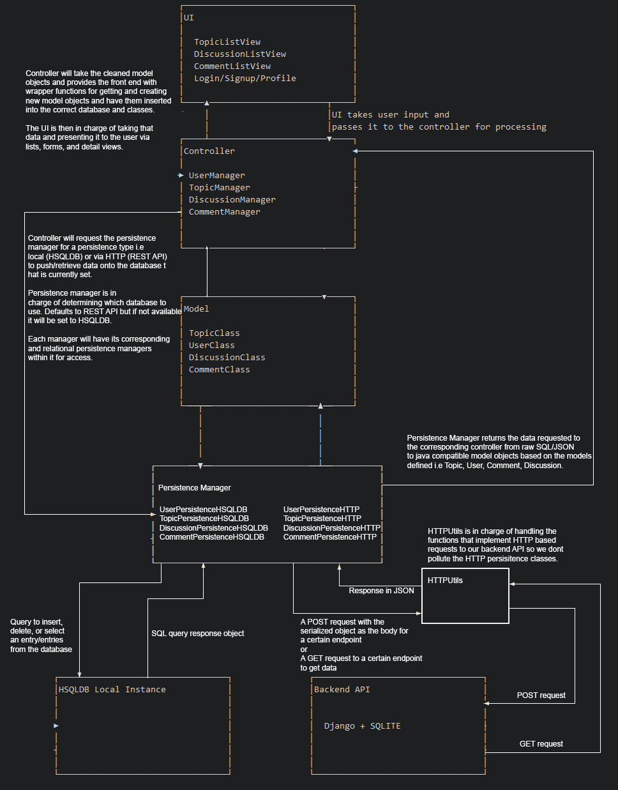

Architecture
============

The architecture we are using is an MVC (Model, View, Controller) set up. We have our base models with their fields but no logic in the Models folder. The views within a UI folder, and the controller/logic in the controller's folder. 
We also have a backend API running Django on a server where the database will be stored. The model will fetch items as raw JSON objects from the back end and turn them into java classes ready for use.  

