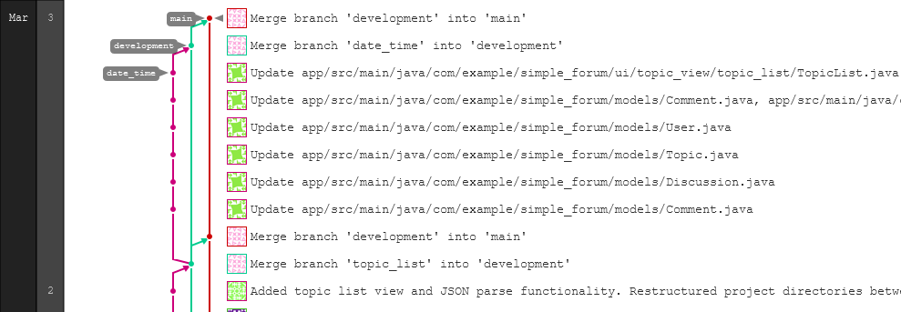

Iteration 1 Worksheet
=====================

Adding a feature
-----------------

When we thought of the idea of a forum, we knew that one of the most important things the user should be able to do is view a list of topics so they could view discussions that were relevant to them. Topics are a way to sort and organize all the different discussions. For example, if someone were to create a discussion talking about their meal they prepared today, it would be situated in a “Cooking” topic. Likewise, if someone were talking about their favorite character from the movie “Avengers,” it would be put into a “Marvel” topic. We then put forward what we needed to make it work, including: 

- How we would read sample text from a JSON file to generate these topics.  

- Creating a GUI capable of displaying said topics. 

- Taking the data read from the JSON file and displaying them on the page. 

 With the base of the topic made, we were able to complete the feature of allowing a user to create a new topic. The user would simply go to the topic page, type the name of the topic they want to create, then click the create button which added the topic to the list.

 
Here is the commit that added the ability to create topics: 5fc2f9a2

Here are the links to the user stories and issues: 

User story: https://code.cs.umanitoba.ca/winter-2022-a02/group-15/simple-forum/-/issues/17 

Feature: https://code.cs.umanitoba.ca/winter-2022-a02/group-15/simple-forum/-/issues/3 

Feature: https://code.cs.umanitoba.ca/winter-2022-a02/group-15/simple-forum/-/issues/4

Here are links to the associated test files: 
https://code.cs.umanitoba.ca/winter-2022-a02/group-15/simple-forum/-/blob/main/app/src/test/java/com/example/simple_forum/TopicManagerTest.java

https://code.cs.umanitoba.ca/winter-2022-a02/group-15/simple-forum/-/blob/main/app/src/test/java/com/example/simple_forum/Topic_test.java

Exceptional code
----------------

On line 39 we test a comment to see if the date variable is storing what we want it to. Before this test we add a date in the correct form for each of the comments. In this test, however, we create a comment with a bad date. Because it is a bad date (not in the correct form) we want the function getDate() to return NULL indicating a bad date was passed. The test assertNull() passes as when we call the constructor of Comment, it will try to parse the string of the date passed into a new SimpleDateFormat variable. the function to parse this will throw a ParseException the value passed is not correct, hence why getDate() returns null as it was not able to turn the string into the new variable format. 

Link: https://code.cs.umanitoba.ca/winter-2022-a02/group-15/simple-forum/-/blob/main/app/src/test/java/com/example/simple_forum/Comment_test.java

Branching
----------

Our branching strategy is a form of Gitflow where we contain a main branch, a development branch, and branches for parts of the project currently being edited/worked on (like the GUI or database). We pull from the latest development branch, make changes, and create a new branch labeled as the area we are changing. Once we are done with the branch, we push it to development where we make sure everything is running smoothly together and then push it to main when we are ready for a release. 

SOLID
-----

SOLID violation of the D Principle in commit 73478053  

The UserAccount class should have fields such as Username, Password, etc., with defined types instead of a HashMap. The HashMap is also not static so any references to this Model Class will have different or empty entries for the Hash Map. 

Issue link: https://code.cs.umanitoba.ca/winter-2022-a02/group-16/pet-exchange-app/-/issues/23 

Agile Planning
--------------

We realized later in development that we expected too much out of ourselves for iteration 1. As this is the first time many of us have seen Android studio, much of our time for iteration 1 was spent getting comfortable with how everything works and how it all comes together. This meant that direct work on things like making a new GUI for a page was slower than if we had the knowledge that we now possess at the end of iteration 1. Now that everyone is a bit more comfortable, we should have a much better and achievable plan for iteration 2. Here are the user stories and features we pushed back: 

Feature https://code.cs.umanitoba.ca/winter-2022-a02/group-15/simple-forum/-/issues/1 

Feature https://code.cs.umanitoba.ca/winter-2022-a02/group-15/simple-forum/-/issues/2 

User Story https://code.cs.umanitoba.ca/winter-2022-a02/group-15/simple-forum/-/issues/5 

User Story https://code.cs.umanitoba.ca/winter-2022-a02/group-15/simple-forum/-/issues/7 

User Story https://code.cs.umanitoba.ca/winter-2022-a02/group-15/simple-forum/-/issues/8 

User Story https://code.cs.umanitoba.ca/winter-2022-a02/group-15/simple-forum/-/issues/10 
