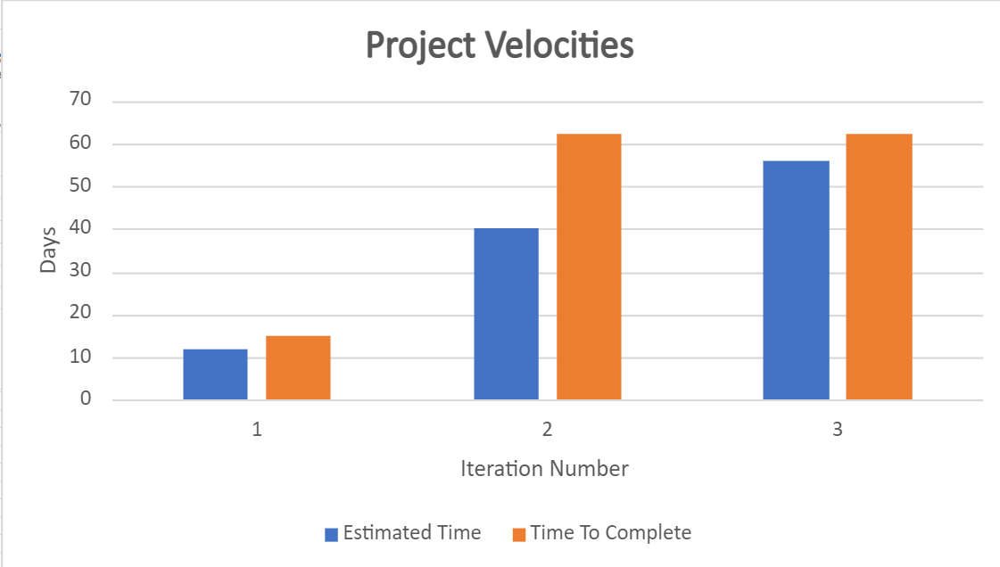

What technical debt has been cleaned up
========================================

We had a lot of technical debt in the persistence models we used. They were too tightly coupled together and the abstraction wrappers for them were too complex to use and relied upon a lot of the users due diligence to pass in valid data. We cleaned a lot of this up by implementing a structure that can switch between stub, HTTP, and HSQLDB based persistence models with its own validators within it. It also provided the user with a manager class that had a wrapper to those persistence layers that required almost no extra due diligence from the user. 

Some links with most feature implementations and fixes can be found at:
https://code.cs.umanitoba.ca/winter-2022-a02/group-15/simple-forum/-/merge_requests/70
https://code.cs.umanitoba.ca/winter-2022-a02/group-15/simple-forum/-/merge_requests/67
https://code.cs.umanitoba.ca/winter-2022-a02/group-15/simple-forum/-/merge_requests/64
https://code.cs.umanitoba.ca/winter-2022-a02/group-15/simple-forum/-/merge_requests/63
https://code.cs.umanitoba.ca/winter-2022-a02/group-15/simple-forum/-/merge_requests/62
https://code.cs.umanitoba.ca/winter-2022-a02/group-15/simple-forum/-/merge_requests/52

What technical debt did you leave?
==================================

If we had more time we would have liked to create an SQL connector like we made an HTTP connector for our HTTP based persistence. As of right now the HTTP persistence models only worry about cleaning the requests into formats the managers can use and implement as well as serializing data to be pushed onto the backend. We would have liked to have a centralized connector like this for SQL instead of each SQL based persistence class doing all the querying, inserting, and selecting all within its class, while also being in charge of cleaning the data and serializing data. 

Discuss a Feature or User Story that was cut/re-prioritized
============================================

We reprioritized most of the POST/CREATE requests to our persistence models and focused more on the proper retrieval of them. We did this because sending a POST request or an SQL insert query is easier to do but also when it comes to retrieving data we wanted to make sure that the foreign keys and primary keys were being properly retrieved and in sync with our persistence models. 

Acceptance test/end-to-end
==========================

“As a user, I should be able to comment on any discussion available.”
We created tests for each step:
Registration of a user
Signing into the application
Creating a new topic
Creating a new discussion
Creating a new comment to that discussion

As we moved through the steps, we used the previous step as a starting point and just added to it. We used assertion to locate page-specific text and ensured that we were on the required page for each of the tests.
https://code.cs.umanitoba.ca/winter-2022-a02/group-15/simple-forum/-/tree/test_branch

**The acceptance tests can be ran under the android tests folder as AllAcceptance 

Acceptance test, untestable
===============

We took some time figuring out how to use Expresso. We had to consider the compatibility of androidx and android.support libraries. We started the test using android.support, only to find out later on that we had to use androidx. We also had a few issues with having to figure out how to switch to our local test db instead of writing acceptance tests that push test data onto our main database. 

The tests were challenging at the start, but went only pretty smoothly, once we got the hang of it.

Velocity/teamwork
=================

Over each iteration our time estimates for features improved substantially. During the first iteration it was extremely hard to gauge how much time would be needed for each feature as none of us had experience working in android studio. Without previous experience, we were left to almost guess how much time each feature would take. We ended up assigning way too much work for milestone 1 and had to push a lot of it back into milestone 2.

Here is some evidence of our estimates improving over time: 

Issue #4 which was completed in iteration 1 had an estimate of 6 days when it actually took 3.

In milestone 3 most estimates were spot on if not fairly close to the actual time spent, whereas in milestone 2, estimates were quite far off from how much time the tasks actually took. See the chart below:

